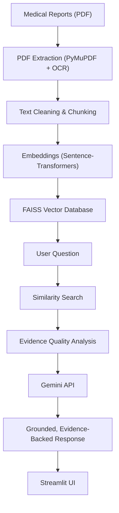

<div align="center">

# OncoGuide AI

### An AI-powered companion that helps cancer patients understand their medical reports


[](https://drive.google.com/drive/folders/18em9aviIRV1wiMohRW4WBGOsSa1u7h60?usp=sharing)
[](https://oncoguide-ai-fuwyaukyjwcpogxtdzeb6t.streamlit.app)

</div>

Cancer patients are handed pathology reports, MRI and CT scans, blood work, and follow-up notes filled with clinical language they were never trained to read. **OncoGuide AI** turns that stack of PDFs into a single, evidence-grounded conversation. Upload any combination of reports, ask questions in plain English, and get answers that point back to the exact passages they came from — alongside a clear timeline of the patient's journey and jargon explained in everyday terms.

> **Educational tool, not a medical device.** OncoGuide AI helps patients and caregivers understand their own reports in plain language. It does not diagnose, prescribe, or replace a licensed healthcare professional — always discuss reports and treatment decisions with your care team. Sample reports in this repository are for demonstration only; handle real patient data in line with applicable privacy regulations.

---

## Table of Contents

- [Demo](#demo)
- [Key Features](#key-features)
- [Architecture](#architecture)
- [Tech Stack](#tech-stack)
- [Project Structure](#project-structure)
- [Getting Started](#getting-started)
- [Key Challenges Solved](#key-challenges-solved)
- [Roadmap](#roadmap)
- [Contributing](#contributing)
- [License](#license)
- [Acknowledgments](#acknowledgments)
- [Connect](#connect)

## Demo

**[Try the live app](https://oncoguide-ai-fuwyaukyjwcpogxtdzeb6t.streamlit.app)** · **[Watch the demo video](https://drive.google.com/drive/folders/18em9aviIRV1wiMohRW4WBGOsSa1u7h60?usp=sharing)**

The recording walks through the core experience: uploading multiple report types, automatic report classification, a plain-language report explanation, and a live Q&A session with the evidence-backed chatbot.

<!-- Add app screenshots here, e.g.  -->

## Key Features

- **Multi-Report Upload & Classification** — Upload pathology, MRI, CT, PET, blood, and follow-up reports together; each is automatically classified so the system knows which report is which.
- **OCR for Scanned Reports** — Falls back to EasyOCR automatically when a PDF has no selectable text.
- **Retrieval-Augmented Generation** — Every answer is grounded in retrieved report excerpts rather than the model's general knowledge, reducing hallucination.
- **Conversational Chatbot with Memory** — Remembers earlier questions in the session, so patients don't have to repeat context.
- **Cross-Report Reasoning** — Connects findings across MRI, pathology, and blood reports into one unified answer instead of analyzing each report in isolation.
- **Patient Timeline & Journey** — Automatically builds a chronological view of diagnosis, treatment, and follow-up.
- **Evidence-Backed, Confidence-Scored Answers** — Every response shows its supporting excerpts and an evidence-quality assessment, so answers can be verified.
- **Medical Terminology Simplification** — Translates clinical jargon (e.g., "metastasis") into plain language on the fly.
- **Structured Patient Summaries** — One-click summary of diagnosis, treatments, current status, and key findings.

<details>
<summary><strong>See all 19 features in detail</strong></summary>

1. **Multiple PDF Upload** — Upload several reports (MRI, CT, pathology, histopathology, blood, follow-up) at once; all are processed together.
2. **Automatic Report Classification** — Every uploaded PDF is classified by report type so the right report is retrieved for the right question.
3. **OCR Support** — Scanned reports with no selectable text are automatically run through EasyOCR to recover the text.
4. **Intelligent Text Chunking** — Reports are split into semantic chunks for better retrieval, lower token usage, and faster search.
5. **Embedding Generation** — Every chunk is converted into a dense vector using Sentence-Transformers (`all-MiniLM-L6-v2`).
6. **FAISS Vector Database** — All embeddings are stored locally in FAISS for fast, scalable similarity search.
7. **Retrieval-Augmented Generation** — The chatbot retrieves relevant report sections before answering, grounding responses in evidence instead of general knowledge.
8. **Medical Report Explanation** — Generates a patient-friendly explanation covering diagnosis, key findings, treatment plan, and patient status.
9. **Medical Terminology Simplification** — Automatically explains complex medical terms in plain language.
10. **AI Chatbot** — Answers natural-language questions about diagnosis, tumor progression, treatments, stage, and medications.
11. **Conversational Memory** — Remembers previous questions in the session so users don't need to repeat context.
12. **Smart Report Selection** — Automatically retrieves the correct report (e.g., the MRI) when a question refers to a specific one.
13. **Cross-Report Reasoning** — Connects information across multiple reports for a more complete answer than analyzing each report alone.
14. **Patient Timeline** — Extracts chronological medical events and builds a visual timeline of the patient's care.
15. **Patient Summary** — Generates a structured summary of diagnosis, timeline, treatments, current status, and key findings.
16. **Patient Journey** — Builds a narrative of the patient's treatment journey from diagnosis through follow-up.
17. **Evidence-Based Responses** — Every chatbot response includes supporting excerpts so answers can be traced back to their source.
18. **Evidence Quality Analysis** — Evaluates the retrieved context and estimates a confidence level before presenting an answer.
19. **Modern Streamlit Interface** — Multi-file upload, timeline, report explanations, chat, evidence display, and structured summaries in a clean, ChatGPT-inspired UI.

</details>

## Architecture

OncoGuide AI is built around a Retrieval-Augmented Generation (RAG) pipeline so every answer stays grounded in the patient's actual reports instead of the model's general medical knowledge.



The initial prototype ran entirely locally on Ollama with Llama 3. The project has since migrated to the Google Gemini API for faster responses and easier public deployment, while the retrieval layer — chunking, embeddings, and FAISS search — stays fully local.

## Tech Stack

| Category | Technology |
|---|---|
| Language | Python |
| Frontend | Streamlit |
| LLM | Google Gemini API (originally Ollama + Llama 3) |
| Embeddings | Sentence-Transformers — `all-MiniLM-L6-v2` |
| Vector Database | FAISS |
| OCR | EasyOCR |
| PDF Processing | PyMuPDF (`fitz`) |
| Orchestration | LangChain, LangChain Community, LangChain Text Splitters |

## Project Structure

```
OncoGuide-AI/
├── .streamlit/
│   └── secrets.toml                     # Gemini API key for Streamlit Cloud (keep out of version control)
├── data/
│   └── reports/                         # Sample reports for local testing
│       ├── Sample_Report_1_Pathology.pdf
│       ├── Sample_Report_2_MRI.pdf
│       ├── Sample_Report_3_Laboratory.pdf
│       └── Sample_Report_4_Oncology_Followup.pdf
├── llm/
│   ├── llm_engine.py                    # Interfaces with the Gemini LLM
│   └── prompt_builder.py                # Builds grounded prompts from retrieved context
├── services/
│   ├── chat_service.py                  # Coordinates chatbot interactions
│   ├── report_service.py                # Report-level orchestration
│   └── retrieval_service.py             # Retrieves relevant report chunks
├── src/
│   ├── case_summary_generator.py        # Produces structured patient summaries
│   ├── chatbot.py                       # Core chatbot orchestration
│   ├── chunk_ranker.py                  # Ranks retrieved chunks by relevance
│   ├── context_fusion.py                # Merges context across reports
│   ├── context_optimizer.py             # Optimizes context sent to the LLM
│   ├── conversation_context.py          # Builds conversational context
│   ├── cross_report_reasoner.py         # Connects findings across reports
│   ├── embeddings.py                    # Generates vector embeddings
│   ├── evidence.py                      # Evidence data structures
│   ├── evidence_analyzer.py             # Assesses evidence quality and confidence
│   ├── medical_information_extractor.py # Extracts structured medical data
│   ├── medical_terms.py                 # Simplifies medical terminology
│   ├── memory.py                        # Maintains conversational memory
│   ├── patient_journey.py               # Builds treatment journey narratives
│   ├── patient_timeline.py              # Generates the patient timeline
│   ├── pdf_reader.py                    # Extracts text from PDFs, with OCR fallback
│   ├── rag_pipeline.py                  # End-to-end RAG pipeline
│   ├── report_classifier.py             # Automatically classifies report type
│   ├── report_explainer.py              # Generates plain-language report explanations
│   ├── report_selector.py               # Selects the most relevant report for a query
│   ├── response_formatter.py            # Formats AI responses for the UI
│   ├── retrieval_service.py             # Vector similarity search
│   ├── text_chunker.py                  # Splits reports into semantic chunks
│   ├── timeline_extractor.py            # Extracts chronological medical events
│   └── vector_store.py                  # Builds and queries the FAISS index
├── app.py                               # Streamlit application entry point
├── requirements.txt                     # Python dependencies
├── test.py                              # Test script
├── .env                                 # Environment variables (not committed)
└── .gitignore
```

*Auto-generated folders such as `__pycache__/` and `venv/` are omitted above for clarity.*

## Getting Started

### Prerequisites

- Python 3.10 or higher
- A Google Gemini API key ([get one here](https://aistudio.google.com/))

### Installation

```bash
# Clone the repository
git clone https://github.com/raghuvendra34/OncoGuide-AI.git
cd OncoGuide-AI

# Create and activate a virtual environment
python -m venv venv
source venv/bin/activate      # Windows: venv\Scripts\activate

# Install dependencies
pip install -r requirements.txt

# Add your Gemini API key
echo "GEMINI_API_KEY=your_api_key_here" > .env

# Run the app
streamlit run app.py
```

For Streamlit Cloud deployment, add the key to `.streamlit/secrets.toml` instead:

```toml
GEMINI_API_KEY = "your_api_key_here"
```

### Usage

1. Launch the app with `streamlit run app.py`.
2. Upload one or more reports (sample reports are provided in `data/reports/`).
3. Ask questions in plain English, e.g. *"What is my diagnosis?"* or *"Has my tumor grown since the last MRI?"*
4. Review the answer alongside its supporting evidence, confidence score, and the patient timeline.

## Key Challenges Solved

- Reading and reasoning across multiple medical reports in a single session
- Handling scanned PDFs with no selectable text via OCR
- Automatically classifying heterogeneous report types
- Improving retrieval accuracy through semantic chunking and embeddings
- Reducing hallucinations by grounding every answer in retrieved evidence
- Preserving conversational context across multi-turn questions
- Linking information across reports for cross-document reasoning
- Simplifying technical medical language for non-medical readers
- Presenting evidence alongside AI answers to improve transparency and trust

## Roadmap

OncoGuide AI has grown from a simple report explainer into a full multi-document RAG assistant with cross-report reasoning, timelines, and evidence-backed answers. Natural next steps include:

- Public cloud deployment, now that the pipeline runs on the Gemini API instead of a local LLM
- Support for additional report types, such as radiology and genomic panels
- Multi-language support for regional languages
- User authentication with secure, persistent patient history
- One-click export of patient summaries and timelines as PDF

## Contributing

Contributions, bug reports, and feature suggestions are welcome. Open an issue or submit a pull request to get started.

## License

This project is licensed under the MIT License.

## Acknowledgments

Built on top of some excellent open-source and API tooling: Google Gemini, LangChain, FAISS, Sentence-Transformers, EasyOCR, PyMuPDF, and Streamlit.

## Connect

- **Portfolio:** [raghuvendra34.github.io](https://raghuvendra34.github.io)
- **GitHub:** [@raghuvendra34](https://github.com/raghuvendra34)
- **LinkedIn:** [linkedin.com/in/raghuvendra-kumar-76919128a](https://www.linkedin.com/in/raghuvendra-kumar-76919128a)
- **Email:** [raghuvendrakumar34@gmail.com](mailto:raghuvendrakumar34@gmail.com)